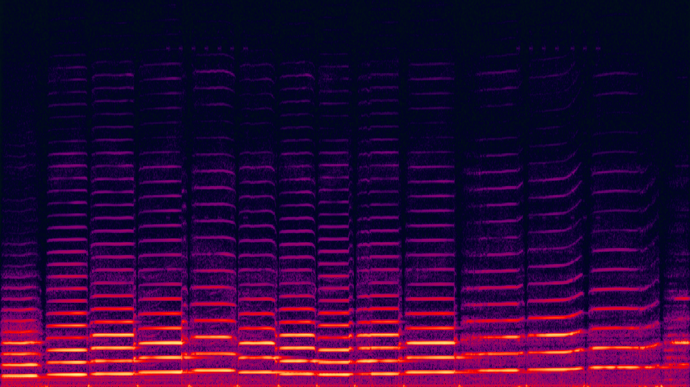
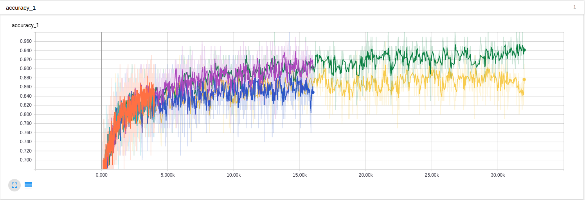
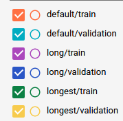

# Transfer Learning for Sound Classification

Identifying sounds in the environment around us is something we as humans do quickly and easily everyday, and yet it is fairly difficult for computers to do this. If computers could accurately identify sounds, this would have lots of applications for robotics, security, and many other areas.

Recently there have been many developments related to computer vision, through advances in deep learning and the creation of large datasets such as [ImageNet](http://www.image-net.org/) for training deep learning models.

The area of auditory perception, however, hasn't quite caught up to computer vision. Google recently released [AudioSet](https://research.google.com/audioset/), a large scale dataset of annotated sounds. Hopefully we'll start to see major improvements in sound classification and similar areas.

In this post, however, we will be looking at how to leverage the recent advances in image classification to improve sound classification.

## Classifying Sounds in an Urban Environment

Our goal is to classify different sounds in the environment using machine learning. For this task we will be using a dataset called [UrbanSound8K](https://serv.cusp.nyu.edu/projects/urbansounddataset/urbansound8k.html). This dataset contains 8732 audio files. There are 10 different types of sounds:

- Air Conditioner
- Car Horn
- Children Playing
- Dog Bark
- Drilling
- Engine Idling
- Gun Shot
- Jackhammer
- Siren
- Street Music

Each sound recording is ~4s in length. The dataset is organized into 10 folds. We will train on all of them, since the script we are going to use will automatically generate a validation set. This dataset is a nice size to start experimenting with, but ultimately I am hoping to train a model on [AudioSet](https://research.google.com/audioset/).

## Features

There are many different features we can train our model on. In the related field of speech recognition, the  Mel-frequency cepstral coefficients (MFCC) is commonly used. The nice thing about MFCC's are that they are a very sparse representation of the original audio, which is usually sampled at 16khz in most research datasets.

Recently, however, there has been a shift towards training models directly on the raw data. For example, DeepMind designed a convolutional architecture called [WaveNet](https://deepmind.com/blog/wavenet-generative-model-raw-audio/) to generate audio. These WaveNets are trained on the raw audio, and not only can they be used generation, they can also be used for speech recognition and other classification tasks.

It would be nice to be able to train a model on more information than the MFCC features, but WaveNets can be computationally expensive to both train and run. What if there was a feature that retained lots of information about the original signal, but was also computationally cheap to train?

This is where spectrograms are useful. In auditory research, a spectrogram is a graphical representation of audio that has frequency on the vertical axis, time on the horizontal axis, and a third dimension of colour represents the intensity of the sound at each time x frequency location.

For example, here is a spectrogram of a violin playing:


[CC BY-SA 3.0, https://commons.wikimedia.org/w/index.php?curid=202335](https://commons.wikimedia.org/w/index.php?curid=202335)

In this spectrogram, we can see many frequencies that are multiples of the fundamental frequency of the note being played. These are called harmonics in music. The vertical lines throughout the spectrogram are the brief pause between strokes of the bow on the violin. So it appears the spectrogram contains lots of information about the nature of different sounds.

The other nice thing about using the spectrogram is that we have now changed the problem into one of image classification, which has seen lots of breakthroughs recently.

Here is a script that will convert each wav file into a spectrogram. Each spectrogram is stored in a folder corresponding to its category.

```
import csv
import os
import librosa
import numpy as np
import matplotlib.pyplot as plt
import librosa.display
import time

count=-1
with open('metadata/UrbanSound8K.csv') as csvfile:
    csvreader = csv.reader(csvfile, delimiter=',')
    for row in csvreader:
        count+=1

        if count == 0:
            continue

        if not os.path.exists('spectrograms/' + row[7]):
            os.makedirs('spectrograms/' + row[7])

        y, sr = librosa.load("audio/fold" + str(row[5])+ "/" + str(row[0]))

        S = librosa.feature.melspectrogram(y, sr=sr, n_mels=128)

        log_S = librosa.logamplitude(S, ref_power=np.max)

        fig = plt.figure(figsize=(12,4))
        ax = plt.Axes(fig, [0., 0., 1., 1.])
        ax.set_axis_off()
        fig.add_axes(ax)

        librosa.display.specshow(log_S, sr=sr, x_axis='time', y_axis='mel')

        plt.savefig('spectrograms/' + row[7] + '/' + row[0] + '.png')
        plt.close()

        #print count
        print '{0}\r'.format(count),
```

## Using Convolutional Neural Networks

Now that the sounds are represented as images, we can classify them using a neural network. The neural network of choice for most image processing tasks is a Convolutional Neural Network (CNN).

The problem with using the UrbanSound8K dataset however is that it is fairly small for deep learning applications. If we were to train a CNN from scratch it would probably overfit to the data; which means that for example, it would memorize all the sounds of dogs barking in UrbanSound8K but would be unable to generalize to the sound of other dog barks in the real world. There is an example of using a CNN for this dataset on Aaqib Saeed's blog [here](http://aqibsaeed.github.io/2016-09-24-urban-sound-classification-part-2/). We are going to take a different approach however and use transfer learning.  

Transfer learning is where we take a neural network that has been trained on a similar dataset, and retrain the last few layers of the network for new categories. The idea is that the beginning layers of the network are solving problems like edge detection and basic shape detection, and that this will generalize to other categories. Specifically, Google has released a pretrained model called [Inception](https://github.com/google/inception), which has been trained on classifying images from the [ImageNet](http://www.image-net.org/) dataset. In fact, Tensorflow already has an example [script](https://github.com/tensorflow/tensorflow/blob/master/tensorflow/examples/image_retraining/retrain.py) for retraining Inception on new categories.

To get started, we will adapt the example from [Tensorflow for Poets](https://codelabs.developers.google.com/codelabs/tensorflow-for-poets/#0) Google Codelab.

First, run this command to download the retraining script.

```
curl -O https://raw.githubusercontent.com/tensorflow/tensorflow/r1.1/tensorflow/examples/image_retraining/retrain.py
```

Now we can run the script to retrain on our spectrograms.

```
python retrain.py \
  --bottleneck_dir=bottlenecks \
  --how_many_training_steps=8000 \
  --model_dir=inception \
  --summaries_dir=training_summaries/basic \
  --output_graph=retrained_graph.pb \
  --output_labels=retrained_labels.txt \
  --image_dir=spectrograms
```

In another terminal tab, you can run

```
tensorboard --logdir training_summaries
```

to start a tensorboard, which will let us watch the training progress and accuracy in our browser. After around 16k iterations the accuracy tops off at ~86% on the validation set. Not bad for a fairly naive approach to sound classification.




## Classifying Sounds from the Microphone

Now that we have a model for classifying sounds, lets apply it to classify sounds from a microphone. The tensorflow retraining example has a [script](https://github.com/tensorflow/tensorflow/blob/master/tensorflow/examples/image_retraining/label_image.py) for labelling images.

I modified this script to label sounds from the microphone. First, the script streams audio from the mic using pyaudio, and uses the webrtcvad package to detect if sound is present at the microphone. If a sound is present it is recorded for 3 seconds, and then converted into a spectrogram and finally labelled.

```
import webrtcvad
import pyaudio
import wave
import os, sys
import librosa
import numpy as np
import matplotlib.pyplot as plt
import librosa.display
import tensorflow as tf

vad = webrtcvad.Vad()
vad.set_mode(2)
FORMAT = pyaudio.paInt16
CHANNELS = 1
RATE = 32000
CHUNK = 960
RECORD_SECONDS = 3
WAVE_OUTPUT_FILENAME = "file.wav"

audio = pyaudio.PyAudio()

# start Recording
stream = audio.open(format=FORMAT, channels=CHANNELS,
                rate=RATE, input=True,
                frames_per_buffer=CHUNK)


    # Unpersists graph from file
with tf.gfile.FastGFile("saved_models/retrained_graph_longest.pb", 'rb') as f:
    graph_def = tf.GraphDef()
    graph_def.ParseFromString(f.read())
    tf.import_graph_def(graph_def, name='')

with tf.Session() as sess:
    # Feed the image_data as input to the graph and get first prediction
    softmax_tensor = sess.graph.get_tensor_by_name('final_result:0')

    while True:

        frames = []
        frameCount = 0

        while frameCount<5:
            data = stream.read(CHUNK)

            if vad.is_speech(data, RATE):
                frameCount+=1;
            else:
                frameCount = 0;
            # print frameCount

        print "recording..."
        for i in range(0, int(RATE / CHUNK * RECORD_SECONDS)):
            data = stream.read(CHUNK)
            frames.append(data)
        print "finished recording"

        waveFile = wave.open(WAVE_OUTPUT_FILENAME, 'wb')
        waveFile.setnchannels(CHANNELS)
        waveFile.setsampwidth(audio.get_sample_size(FORMAT))
        waveFile.setframerate(RATE)
        waveFile.writeframes(b''.join(frames))
        waveFile.close()

        os.environ['TF_CPP_MIN_LOG_LEVEL'] = '2'

        # change this as you see fit
        audio_path = 'file.wav'
        image_path = 'tmp/tmp.jpg'

        y, sr = librosa.load(audio_path)

        # Let's make and display a mel-scaled power (energy-squared) spectrogram
        S = librosa.feature.melspectrogram(y, sr=sr, n_mels=128)

        # Convert to log scale (dB). We'll use the peak power as reference.
        log_S = librosa.logamplitude(S, ref_power=np.max)

        # Make a new figure
        fig = plt.figure(figsize=(12,4))
        ax = plt.Axes(fig, [0., 0., 1., 1.])
        ax.set_axis_off()
        fig.add_axes(ax)

        # Display the spectrogram on a mel scale
        # sample rate and hop length parameters are used to render the time axis
        librosa.display.specshow(log_S, sr=sr, x_axis='time', y_axis='mel')

        # Make the figure layout compact

        #plt.show()
        plt.savefig(image_path)
        plt.close()

        # Read in the image_data
        image_data = tf.gfile.FastGFile(image_path, 'rb').read()

        # Loads label file, strips off carriage return
        label_lines = [line.rstrip() for line
                           in tf.gfile.GFile("saved_models/retrained_labels_longest.txt")]

        predictions = sess.run(softmax_tensor, \
                 {'DecodeJpeg/contents:0': image_data})

        # Sort to show labels of first prediction in order of confidence
        top_k = predictions[0].argsort()[-len(predictions[0]):][::-1]

        print('%s (score = %.5f)' % (label_lines[top_k[0]], predictions[0][top_k[0]]))
        print ""

# stop Recording
stream.stop_stream()
stream.close()
audio.terminate()
```

The script was adapted from this [gist](https://gist.github.com/mabdrabo/8678538) for recording from the mic, and this [gist](https://gist.github.com/mailletf/3484932dd29d62b36092) for generating spectrograms using librosa, as well as the [label_image.py](https://github.com/tensorflow/tensorflow/blob/master/tensorflow/examples/image_retraining/label_image.py) script in tensorflow.

## Next Steps

In this post we saw how to classify sounds by applying transfer learning from the image classification domain. There is definitely room for improvement by tweaking the parameters of the retraining, or by training a model from scratch on the spectrograms. I'm also hoping to train a model to classify sounds using a [WaveNet](https://deepmind.com/blog/wavenet-generative-model-raw-audio/) next.

You can view the code for this tutorial [here](https://github.com/lukeinator42/transfer_learning_sound_classification).
